@[toc]

## Contact

Email: neo@01man.com

## My StackOverflow

## My GitHub


## Certificates

### Google

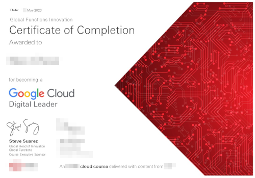

### Microsoft

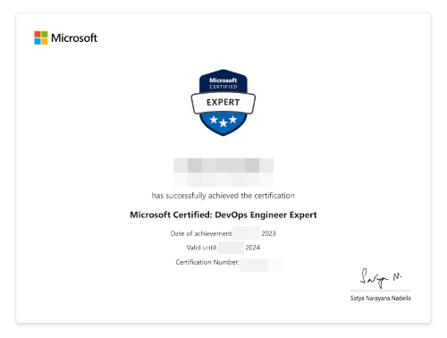

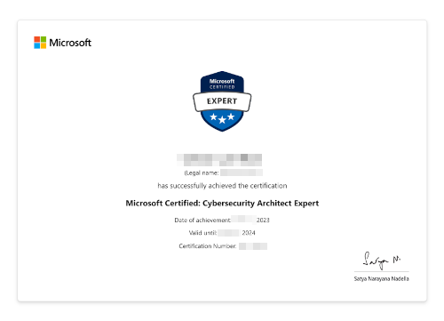

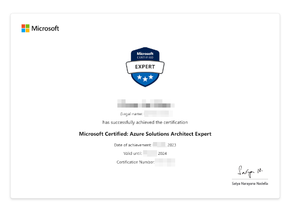

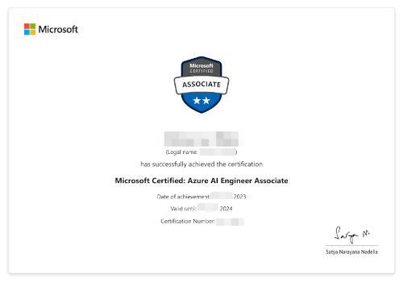

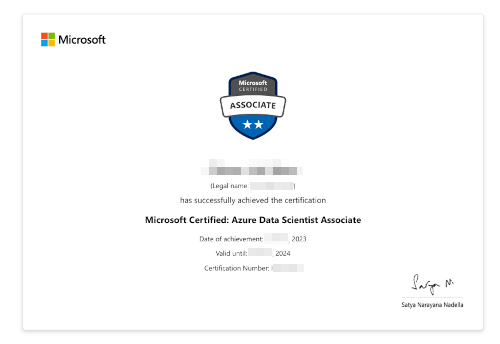

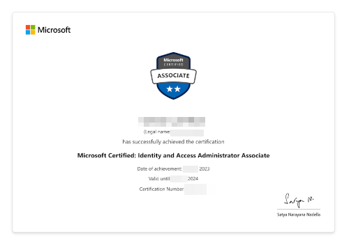

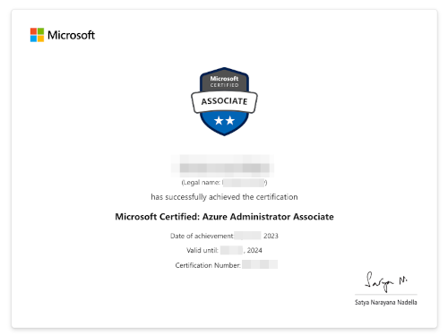

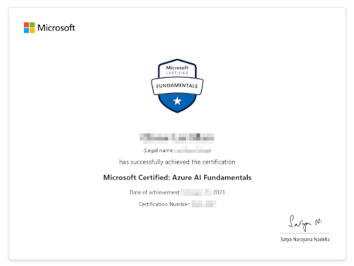

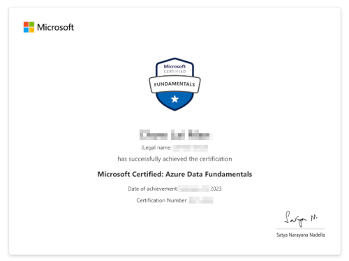

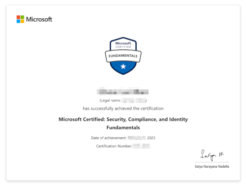

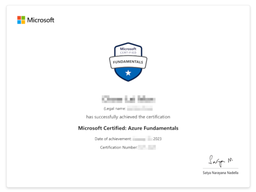

### Microsoft and LinkedIn
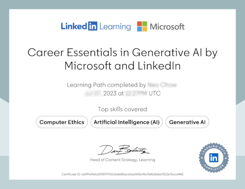

### Alibaba Cloud

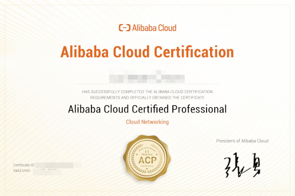

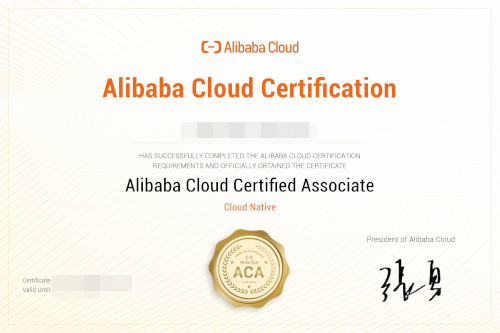

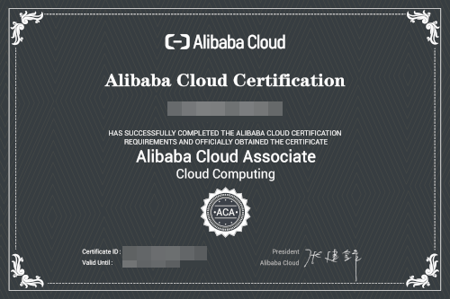

### Other

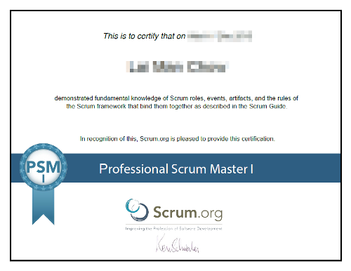

## Badges

### Microsoft
<ul class="badges">
<li class="badges-item"></li>

<li class="badges-item"></li>

<li class="badges-item"></li>

<li class="badges-item"></li>

<li class="badges-item"></li>

<li class="badges-item"></li>

<li class="badges-item"></li>

<li class="badges-item"></li>

<li class="badges-item"></li>

<li class="badges-item"></li>

<li class="badges-item"></li>
</ul>

### Google

#### Skillshop

### Alibaba Cloud

### IBM

### Other

[and more ...](../more-about-me)
