@[toc]

## Contact

Email: neo@01man.com

## My StackOverflow

## My GitHub


## Certificates

### Google

### Microsoft

- 
- 
- 

- 
- 
- 
- 
- 
- 
- 
- 

### Microsoft and LinkedIn

- 

### Alibaba Cloud

- 
- 

- 
- 

### Other

- 

## Badges

### Microsoft

- 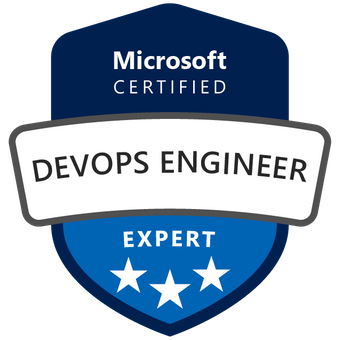
- 
- 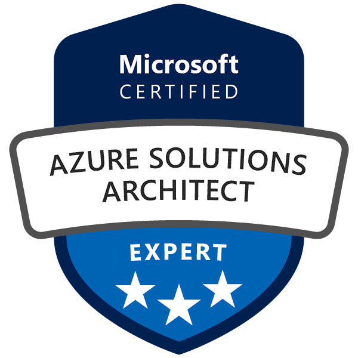
- 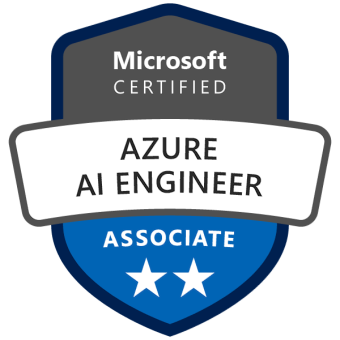
- 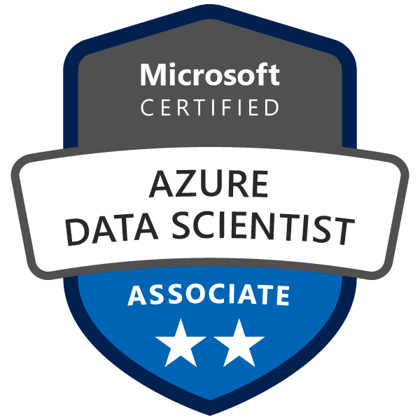
- 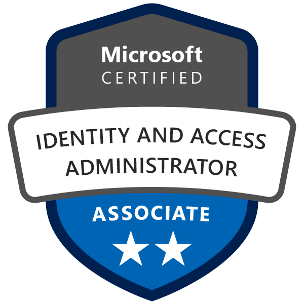
- 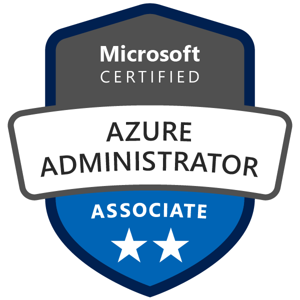
- 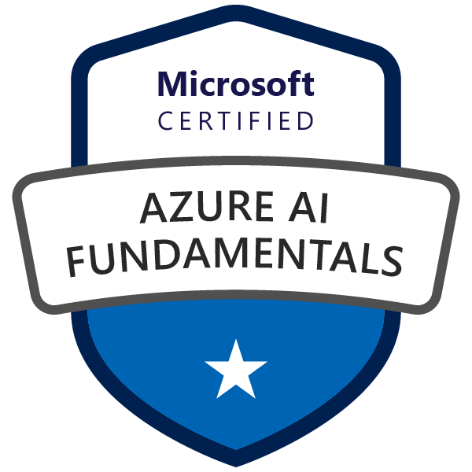
- 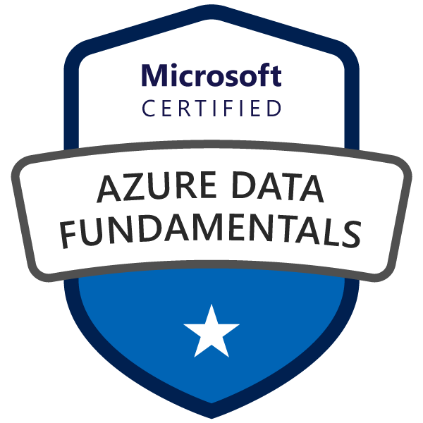
- 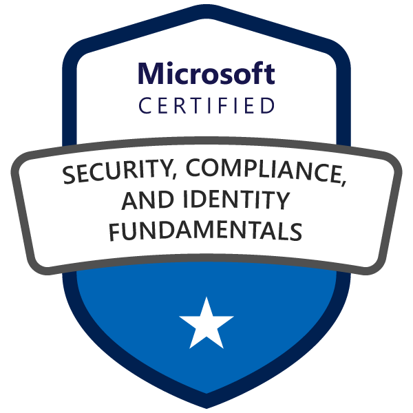
- 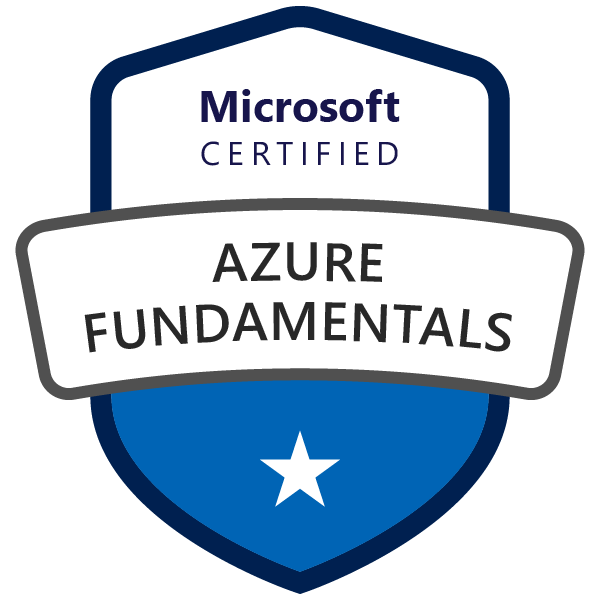

### Google

#### Skillshop

- 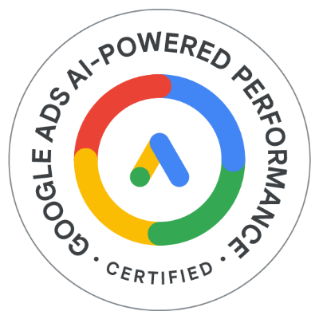
- 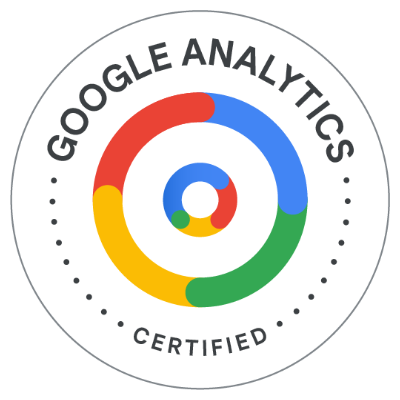

### Alibaba Cloud

- 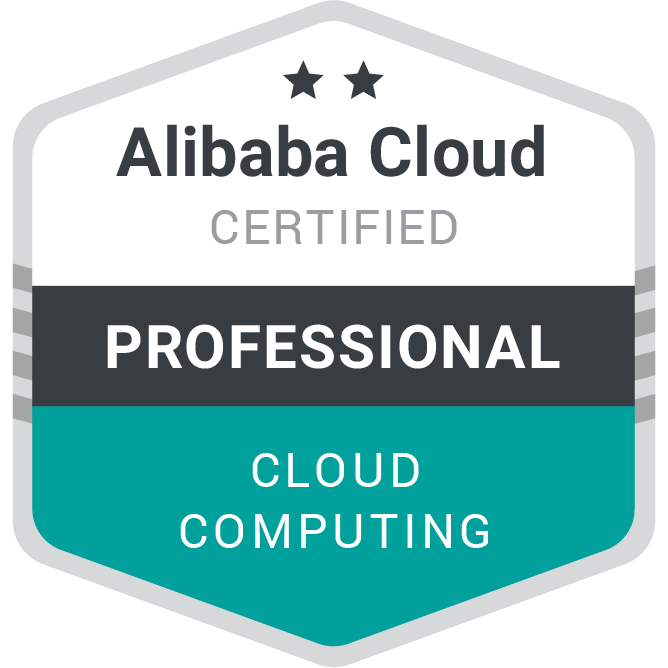
- 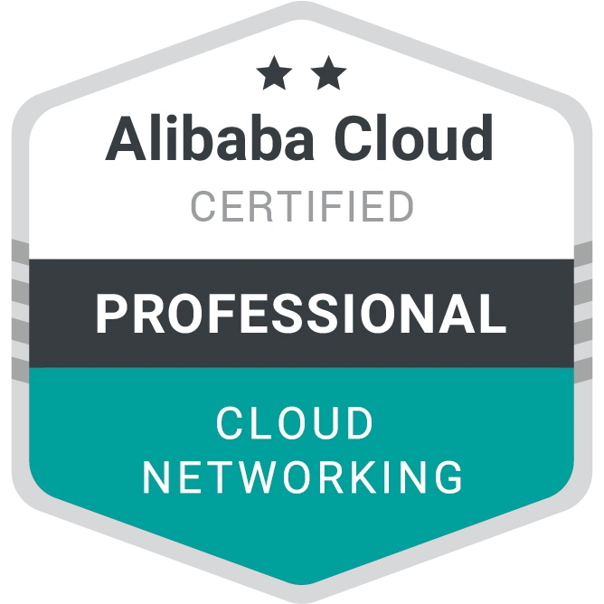
- 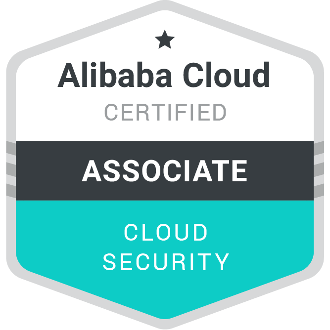
- 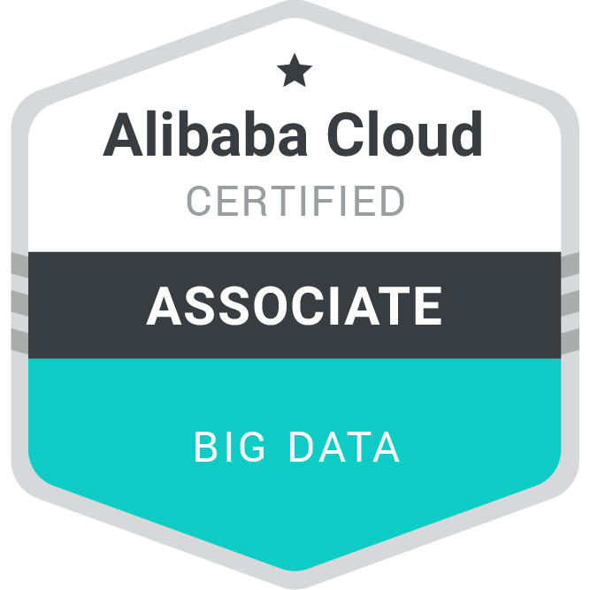
- 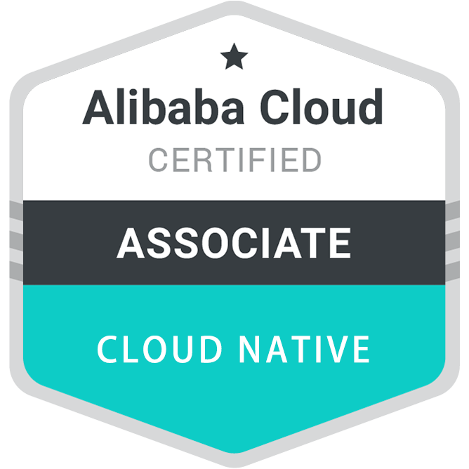
- 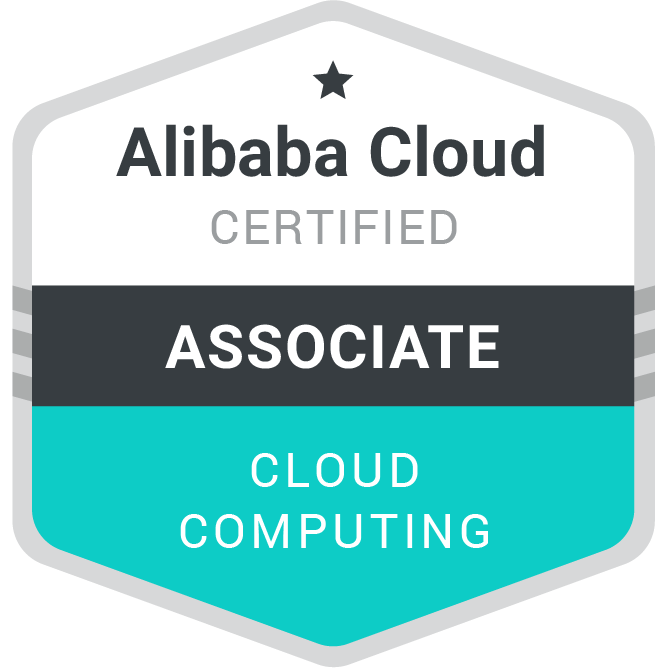
- 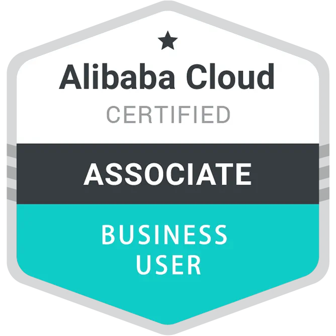
- 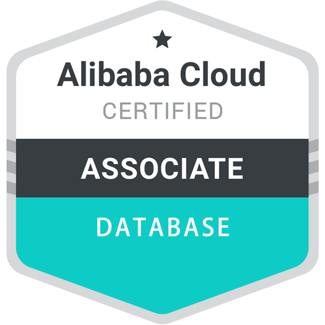
- 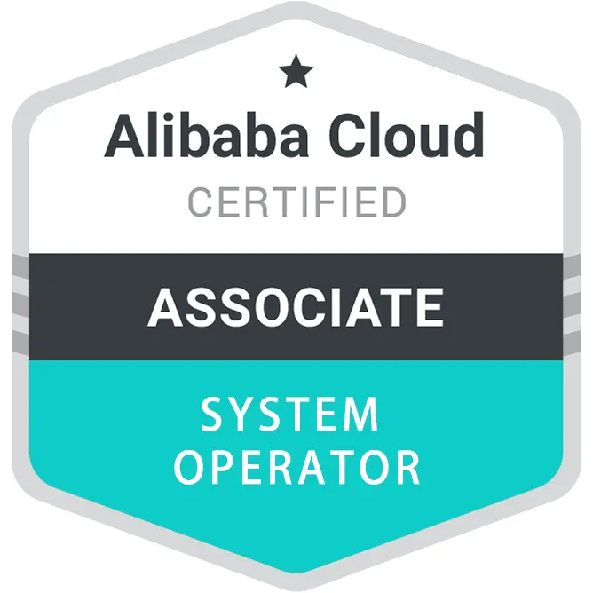

### IBM

- 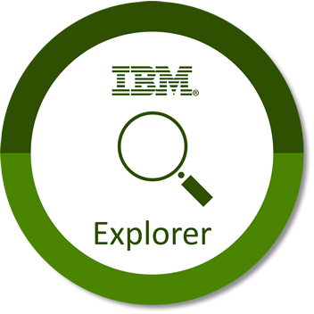

### Other

- 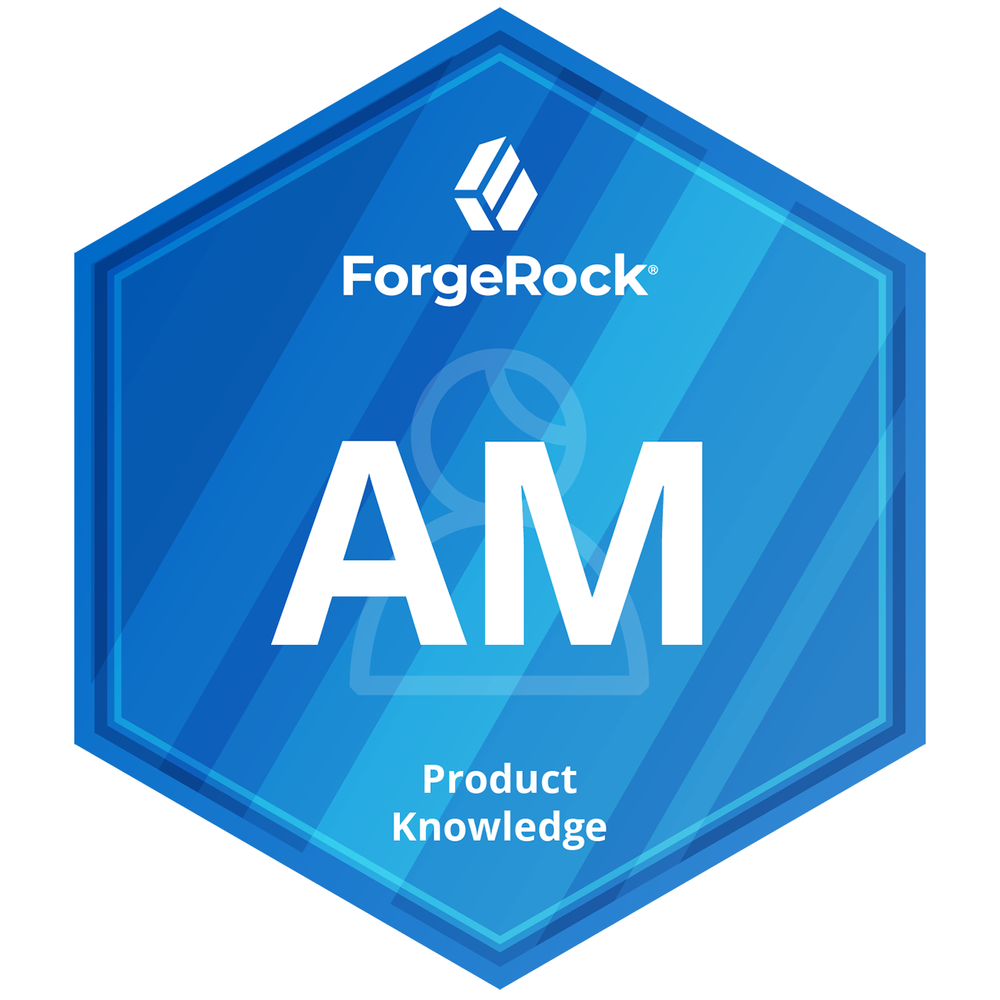

[and more ...](../more-about-me)
